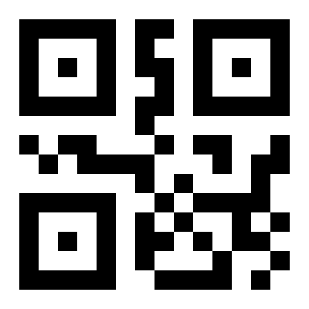
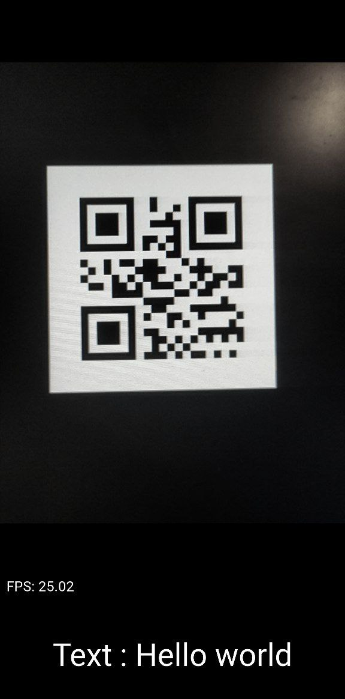

<br/>
<p align="center">
  <a href="https://github.com/wowlikon/wowlikon-qr-scanner">
    
  </a>

  <h3 align="center">QR-Scanner</h3>

  <p align="center">
      qr scanner mobile application
    <br/>
    <br/>
  </p>
</p>

      

## Table Of Contents

* [About the Project](#about-the-project)
* [Built With](#built-with)
* [Getting Started](#getting-started)
  * [Prerequisites](#prerequisites)
  * [Installation](#installation)
* [Usage](#usage)
* [Contributing](#contributing)
* [License](#license)
* [Authors](#authors)
* [Acknowledgements](#acknowledgements)

## About The Project

<a href="https://github.com/wowlikon/wowlikon-qr-scanner">
    
</a>

On the net, I did not find any open source application for scanning QR codes that supports the latest versions of kivy, python and opencv. And so I decided to implement it myself.

* You can make changes to the source code of the project.
* You can use it for your needs.
* Study the operation of applications using computer vision on android

## Built With

For this project I used python3, kivy, opencv and buildozer

## Getting Started

To get a local copy up and running follow these simple example steps.

### Prerequisites

This is an example of how to list things you need to use the software and how to install them.

* python3

```sh
 sudo apt install python3
```

### Installation

1. Clone the repo

```sh
git clone https://github.com/wowlikon/wowlikon-qr-scanner.git
```

2. Install python packages

```sh
pip install -r requirements.txt
```

4. Build app

```sh
buildozer android debug
```

## Usage

You can use this project for your applications and modify the source code to suit your needs.

## Contributing

Contributions are what make the open source community such an amazing place to be learn, inspire, and create. Any contributions you make are **greatly appreciated**.
* If you have suggestions for adding or removing projects, feel free to [open an issue](https://github.com/wowlikon/wowlikon-qr-scanner/issues/new) to discuss it, or directly create a pull request after you edit the *README.md* file with necessary changes.
* Please make sure you check your spelling and grammar.
* Create individual PR for each suggestion.
* Please also read through the [Code Of Conduct](https://github.com/wowlikon/wowlikon-qr-scanner/blob/main/CODE_OF_CONDUCT.md) before posting your first idea as well.

### Creating A Pull Request

1. Fork the Project
2. Create your Feature Branch (`git checkout -b feature/AmazingFeature`)
3. Commit your Changes (`git commit -m 'Add some AmazingFeature'`)
4. Push to the Branch (`git push origin feature/AmazingFeature`)
5. Open a Pull Request

## License

Distributed under the MIT License. See [LICENSE](https://github.com/wowlikon/wowlikon-qr-scanner/blob/main/LICENSE.md) for more information.

## Authors

* **Nemchinov Ilya** - *KTUIS student* - [wowlikon](https://github.com/wowlikon/)
## Acknowledgements

* [liyuanrui](https://github.com/liyuanrui/kivy-for-android-opencv-demo)